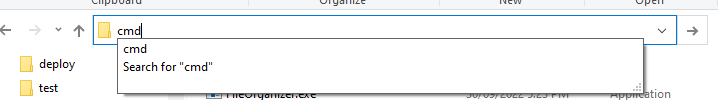

# File Organizer

A simple console application to organize files by their extensions

## How to use
1. [**Download all files** for application](https://github.com/sean1832/Organizer/tree/master/FileOrganizer/deploy)
2. **Extract** files into local directory
3. Open **cmd** in **installed directory**

4. 
<!--stackedit_data:
eyJoaXN0b3J5IjpbMTY4Mzc0OTcyNyw1NDY3NTk2NTAsLTk5NT
gxNDY5NywxMTg5NDk3NDgzXX0=
-->